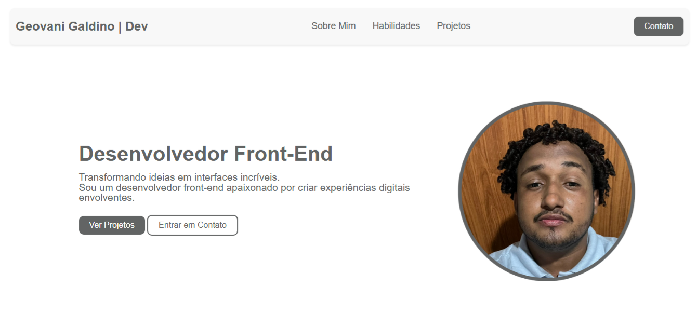

# Portfólio | Geovani Galdino

Bem-vindo ao repositório do meu portfólio! Este projeto foi desenvolvido para apresentar meus principais projetos, habilidades e experiências como desenvolvedor front-end.

## ✨ Sobre

Este portfólio tem como objetivo destacar meus trabalhos, trajetória acadêmica e profissional, além de facilitar o contato com recrutadores e outros desenvolvedores. O layout é responsivo, moderno e conta com modo claro/escuro.

## 🚀 Tecnologias Utilizadas

- **HTML5**
- **CSS3**
- **JavaScript**
- **SVG** (ícones)
- **Font Awesome** (ícones sociais)

## 📱 Responsividade

O site é totalmente responsivo, adaptando-se a diferentes tamanhos de tela (desktop, tablet e mobile) por meio de media queries.

## 🖼️ Funcionalidades

- **Seção Hero:** Apresentação pessoal e chamada para ação.
- **Sobre Mim:** Breve descrição sobre minha trajetória e objetivos.
- **Projetos:** Cards com imagem, descrição, tecnologias utilizadas e links para código e demonstração dos projetos.
- **Contato:** Formulário para envio de mensagens e links para redes sociais (GitHub, LinkedIn, e-mail).
- **Modo Claro/Escuro:** Alternância de tema para melhor experiência do usuário.

## 📂 Estrutura de Pastas

```
assets/
  img/           # Imagens do portfólio e projetos
  styles/        # Arquivos CSS
index.html       # Página principal
script.js        # Arquivo JavaScript
```

## 🛠️ Como rodar o projeto

1. Clone este repositório:
   ```bash
   git clone https://github.com/geovanigaldino/portfolio.git
   ```
2. Acesse a pasta do projeto:
   ```bash
   cd portfolio
   ```
3. Abra o arquivo `index.html` no seu navegador.

## 📸 Demonstração



## 📬 Contato

- [LinkedIn](https://www.linkedin.com/in/geovanigaldino/)
- [GitHub](https://github.com/geovanigaldino)
- [E-mail](mailto:contato.geovanigaldino@gmail.com)

---

Desenvolvido com 💻 por Geovani Galdino.
